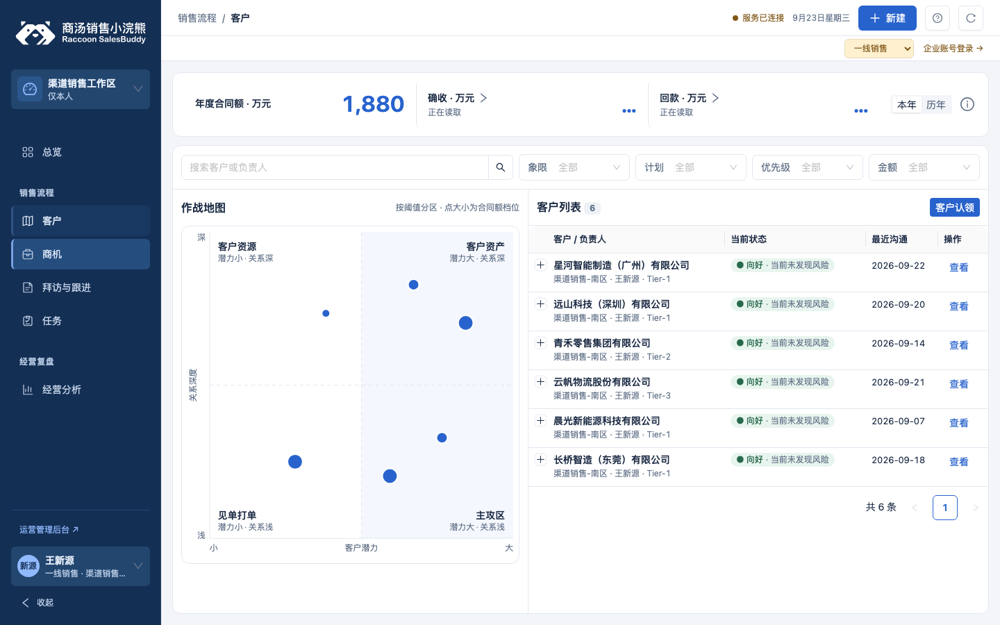

# Web 三项交互调整与验证（2026-09-23）

基线：`shandianT/desgin@f6fbd4b`。这是 GitHub Pages 的 Web 示例页面；本轮改动在独立分支提交 PR，合并 main 后由 Pages 工作流发布。新组件属性尚未发布为 npm 包。

## 结果

| 用户反馈 | 本轮实现 |
| --- | --- |
| 阶段要能打勾多选，选完再筛选 | `SbLabeledSelect` 增加 `confirmMultiple`；勾选暂存，应用时一次更新完整阶段数组并调用原查询。取消、Esc、外部点击丢弃暂存；清空后应用恢复全部。单条商机阶段的业务约束不变。 |
| 地图左右区域大小不一致 | `SbBattleMap` 增加 `layout="equal"`，按阈值分段映射坐标，使绘图区四区等宽、等高。原页面 70 分阈值映射到中心，原分数、象限归属、计数及点大小含义不变；提示说明两侧比例尺不同。默认组件仍使用线性布局。 |
| 录音和上传沿用了手机切换方式 | 录音按钮、计时与 Ant Design `Upload.Dragger` 同时展示，文件可选择或拖入。只调用原保存草稿、上传、轮询提取方法，显示进度、失败重试与提取完成。窄屏上下排列。 |

同时修复原展示源码中窄屏侧栏隐藏规则优先级不足的问题，避免侧栏遮住录入区域；较窄桌面让录音和上传分行，计时不与按钮重叠。

采用规则：V-01、V-02、V-03、C-01、C-02、C-04、C-06、C-07；保留 B-04 的人工核对流程与 B-05 的原权限契约。规范版本为规则 1.0.0，跨端草案 1.1.0-draft.1。图表章节与新增布局属于实现建议，没有将草稿升级为正式规范。新增设计变量：0。

## 修改位置与可维护性

- `department-ui/Opportunities.jsx`、`Customers.jsx`、`VisitEntry.jsx`、`visit-entry.css`：三项页面调整。
- `department-ui/frame.css`：窄屏导航隐藏规则。
- `packages/ui-react/src/components/SbLabeledSelect.jsx`、`SbBattleMap.jsx`：可选组件能力，配套更新类型、目录示例、用法、元数据、样式与未发布变更记录。
- `tools/build-web-demo.mjs`、`tools/check.mjs`、`.github/workflows/pages.yml`：从本仓库展示源码及组件源码重建样板，更新确定性的资源缓存标识。
- `tools/verify-web-interactions.mjs`：针对真实 Web 示例入口的浏览器检查。

仓库原来只有打包产物。本次恢复 43 个展示源文件；其中 38 个保持原样，5 个作上述修改。来源 ZIP 中三份产物与基线逐字节相同，归档、产物及原始源文件的 SHA-256 见 [来源记录](source-provenance.json)。业务 `demo/web/bundle.js` 没有修改。

录入页直接组合上游 Upload、Progress、Alert：部门 `SbUpload` 当前接口以文件列表和 `request(file) -> url` 为主，不能直接表达已有草稿保存、上传进度和提取轮询的不同阶段。这里只连接既有业务处理，没有增加另一套上传接口或新通用组件。

## 验证

| 检查 | 结果 |
| --- | --- |
| `node tools/check.mjs --verify` | 通过；通用样板 252/252 项通过。 |
| 最终 `node tools/check.mjs` | 通过；Web 源码 43 文件、组件源码 45 文件、小程序样式 106 文件均为 0 违规；类型覆盖 44 个导出；组件目录与 Web 构建通过。 |
| `node tools/verify-web-interactions.mjs` | 13/13 组通过，浏览器脚本错误 0。 |
| 重建一致性 | 最终 Web 构建连续两次得到相同缓存标识 `185c85830907`。 |

专项覆盖：多选暂存、一次应用、取消／Esc／外部关闭、键盘勾选与焦点循环、清空、分页、关键词组合与空结果；四区尺寸、原始评分和计数、放大返回；非法文件拦截、选择与拖拽各只触发一次上传、失败重试保留文字；虚拟麦克风开始／计时／结束、处理期间禁用、模拟权限拒绝；1440×900、1024×600、390×844 视口；总览、任务和创建客户页面冒烟。

机器结果：[专项检查](review/results.json) · [通用样板 252 项](review/sample-results.json)。通用样板本身未改，本轮未用本机字体渲染替换其原有 56 张截图。

| 本地演示 | 真实接口 | 跨端读回 | 生产验证 |
| --- | --- | --- | --- |
| 已验证（本地），浏览器合成数据；录音使用虚拟音源 | 未验证。示例接口不提供上传或转写；进度与成功状态用显式合成数据验证展示 | 未验证 | 未验证；PR 合并发布前线上仍是旧版 |

当前限制：未测试真机麦克风、真实文件提取服务、实际用户权限或归档回执；没有修改小程序，也没有发布新的 npm 版本。构建仍会提示现有目录脚本体积超过 500kB，该提示不影响构建通过。

复跑专项检查需可导入的 Playwright 与 Chromium，并先在另一终端启动：

```sh
python3 -m http.server 5198 --bind 127.0.0.1 --directory demo/web
node tools/verify-web-interactions.mjs
```

## 效果图





窄屏：[390px](review/visit-390.png) · [1024px](review/visit-1024.png)。这两张图含标明的合成提取成功状态，不作为真实转写证据。
