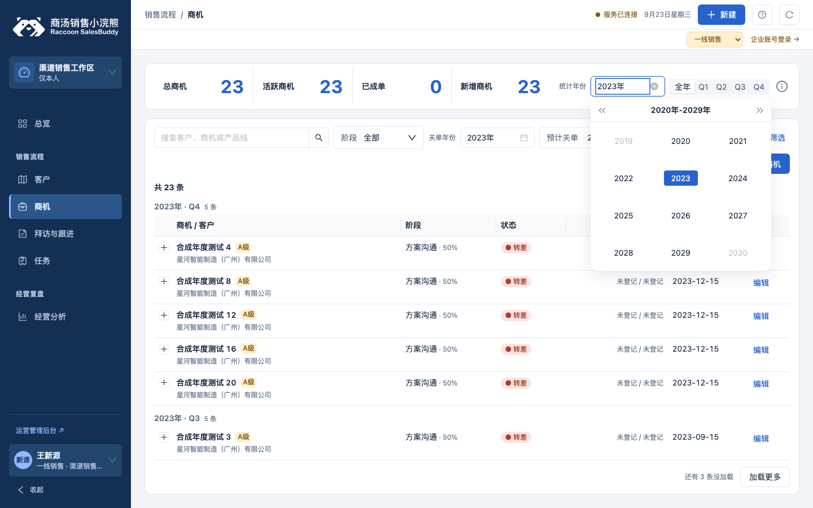
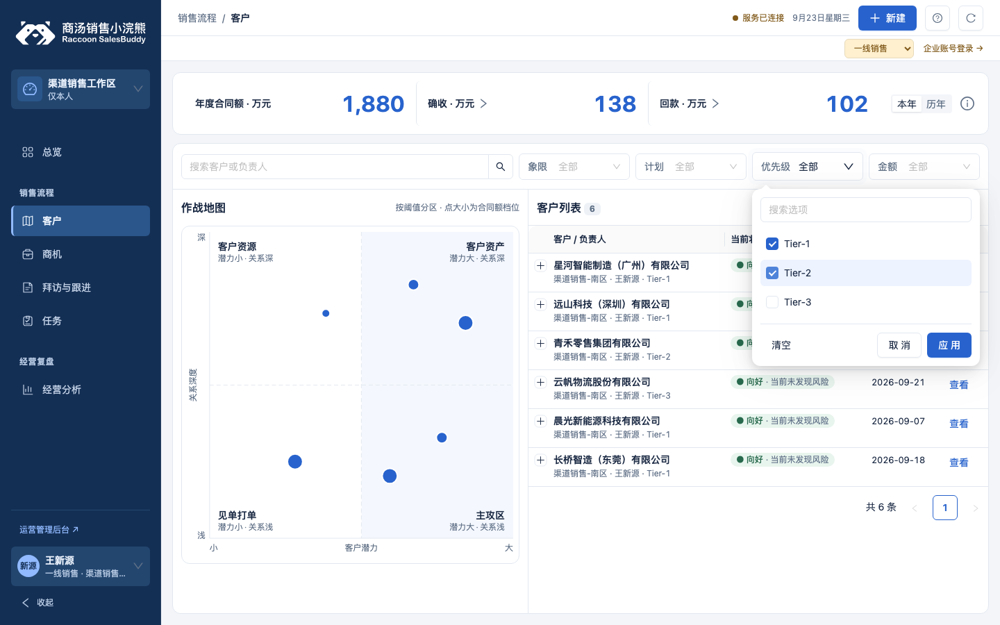
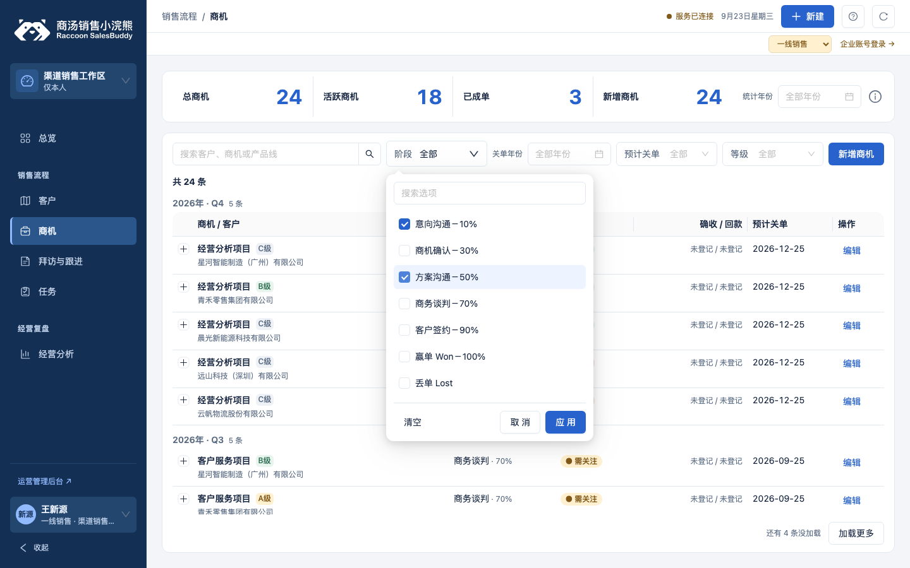
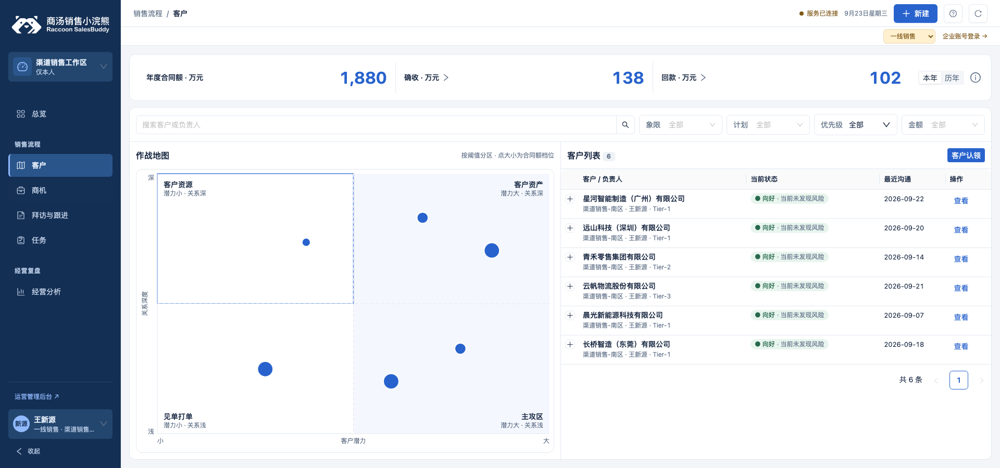
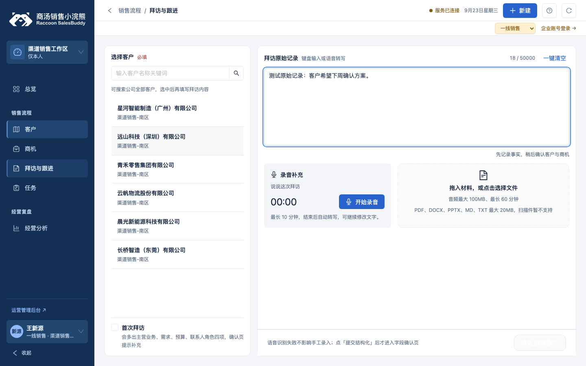

# Web 多选筛选、录入与地图调整验证（2026-09-23）

基线：`shandianT/desgin@f6fbd4b`。这是 GitHub Pages 的 Web 示例页面；本轮改动在独立分支提交 PR，合并 main 后由 Pages 工作流发布。新组件属性尚未发布为 npm 包。

## 结果

| 用户反馈 | 本轮实现 |
| --- | --- |
| 阶段要能打勾多选，选完再筛选 | `SbLabeledSelect` 多选默认采用复选框确认（`confirmMultiple` 默认为 true）；勾选暂存，应用时一次更新完整阶段数组并调用原查询。取消、Esc、外部点击丢弃暂存；清空后应用恢复全部。单条商机阶段的业务约束不变。 |
| 地图左右区域大小不一致 | `SbBattleMap` 增加 `layout="equal"`，按阈值分段映射坐标，使绘图区四区等宽、等高。原页面 70 分阈值映射到中心，原分数、象限归属、计数及点大小含义不变；提示说明两侧比例尺不同。默认组件仍使用线性布局。 |
| 地图整体太窄 | 电脑端地图与列表各占一半；901～1100px 视口地图占 46%，≤900px 上下排列。SVG 按实际绘图区宽高重排，圆点和文字不变形；手机保留正方形。 |
| 年份只有前后一年，无法主动选择 2023 等历史年份 | 用 `SbDatePicker` 的年份模式支持点选、按十年翻页及直接输入；总览提供“统计年份”，列表提供“关单年份”。选某年全年明确传 Q1～Q4，清除年份表示全部历史。总览与列表沿用独立筛选，其他条件与权限保留。 |
| 录音和上传沿用了手机切换方式 | 录音按钮、计时与 Ant Design `Upload.Dragger` 同时展示，文件可选择或拖入。只调用原保存草稿、上传、轮询提取方法，显示进度、失败重试与提取完成。窄屏上下排列。 |

优先级及同类多选筛选也统一采用该交互，共 7 处调用：客户优先级、协助成员、销售商机阶段、商机看板阶段，以及 FDE 商机人员、阶段、关单季度。优先级、看板阶段、FDE 阶段／季度均一次更新完整数组后调用原筛选／加载方法。年份和等级保持单选；需兼容即时多选的组件使用方可显式传 `confirmMultiple={false}`。

同时修复原展示源码中窄屏侧栏隐藏规则优先级不足的问题，避免侧栏遮住录入区域；较窄桌面让录音和上传分行，计时不与按钮重叠。

采用规则：V-01、V-02、V-03、C-01、C-02、C-03、C-04、C-06、C-07、T-05、B-03；保留 B-04 的人工核对流程与 B-05 的原权限契约。规范版本为规则 1.0.0，跨端草案 1.1.0-draft.1。图表章节与新增布局属于实现建议，没有将草稿升级为正式规范。新增设计变量：0。

## 修改位置与可维护性

- `department-ui/Opportunities.jsx`、`Customers.jsx`、`VisitEntry.jsx`、`visit-entry.css`、`customers.css`：三项页面调整。
- `department-ui/FdePages.jsx`、`SmallPages.jsx`：统一确认后一次提交阶段／季度数组。
- `department-ui/frame.css`：窄屏导航隐藏规则。
- `department-ui/Opportunities.jsx`、`opportunities.css`：年份选择、独立统计／关单年份查询、全年语义与手机统计两列布局。`demo/web/preview-api.js`：合成示例总览空季度与原 `matchesQuarter`／列表的全部历史契约一致。
- `packages/ui-react/src/components/SbLabeledSelect.jsx`、`SbBattleMap.jsx`：可选组件能力，配套更新类型、目录示例、用法、元数据、样式与未发布变更记录。
- `tools/build-web-demo.mjs`、`tools/check.mjs`、`.github/workflows/pages.yml`：从本仓库展示源码及组件源码重建样板，更新确定性的资源缓存标识。
- `tools/verify-web-interactions.mjs`、`tools/verify-multiple-filters.mjs`：针对 Web 示例入口及各角色多选筛选的浏览器检查。
- `tools/verify-opportunity-years.mjs`：独立浏览器注入跨年合成数据，核对年份请求、结果、分页与恢复；不修改使用者浏览器数据。

仓库原来只有打包产物。本次恢复 43 个展示源文件；其中 34 个保持原样，9 个作上述修改。来源 ZIP 中三份产物与基线逐字节相同，归档、产物及原始源文件的 SHA-256 见 [来源记录](source-provenance.json)。业务 `demo/web/bundle.js` 没有修改。

录入页直接组合上游 Upload、Progress、Alert：部门 `SbUpload` 当前接口以文件列表和 `request(file) -> url` 为主，不能直接表达已有草稿保存、上传进度和提取轮询的不同阶段。这里只连接既有业务处理，没有增加另一套上传接口或新通用组件。

## 验证

| 检查 | 结果 |
| --- | --- |
| `node tools/check.mjs --verify` | 通过；通用样板 252/252 项通过。 |
| 最终 `node tools/check.mjs` | 通过；Web 源码 43 文件、组件源码 45 文件、小程序样式 106 文件均为 0 违规；类型覆盖 44 个导出；组件目录与 Web 构建通过。 |
| `node tools/verify-web-interactions.mjs` | 14/14 组通过，浏览器脚本错误 0。 |
| `node tools/verify-multiple-filters.mjs` | 新增 6/6 组通过；连同专项 14 组，合计 20 组通过。覆盖另外 6 处多选的暂存、取消、一次应用、清空，优先级结果和分页、阶段结果、季度结果，以及原单选保持。 |
| `node tools/verify-opportunity-years.mjs` | 4/4 组通过；连同上述 20 组，合计 24 组通过。23 条 2023 年记录跨两页加载，2011／2035 年各一条、未登记日期一条；支持年度统计／季度、全部历史、阶段／搜索组合、失败重试及 1440／1024／390px 视口。 |
| 最终 Web 构建标识 | `af3a6924be8f`。 |

专项覆盖：多选暂存、一次应用、取消／Esc／外部关闭、键盘勾选与焦点循环、清空、分页、关键词组合与空结果；四区尺寸、原始评分和计数、放大返回；非法文件拦截、选择与拖拽各只触发一次上传、失败重试保留文字；虚拟麦克风开始／计时／结束、处理期间禁用、模拟权限拒绝；1440×900、1920×900、1920×768、1024×600、390×844 视口；总览、任务和创建客户页面冒烟。

加宽实测：1920×900 下绘图区由约 487px 加宽至 803px；1920×768 下由约 355px 加宽至 803px。电脑端左右栏各占 50%，四区等分；另验证窗口只变高度时的 SVG 比例、圆点形状、悬停提示位置及手机上下排列。尺寸记录见 [地图五档视口](review/map-dimensions.json)。

年份规则：默认空季度明确显示“全部年份”；选某年后才显示全年／季度切换。统计区以各指标原有日期口径查询，列表按预计关单日期查询。选择关单年份会取消“当月／当季度”等相对日期条件，选相对日期则清除独立年份条件，避免冲突；搜索、阶段、等级继续保留。年份无数据时正常显示空结果，清除年份可恢复历史及未登记日期记录。真实服务对相同参数的解释仍需联调验证。

机器结果：[历史年份检查](review/year-results.json) · [多选统一检查](review/multiple-filter-results.json) · [专项检查](review/results.json) · [通用样板 252 项](review/sample-results.json)。通用样板本身未改，本轮未用本机字体渲染替换其原有 56 张截图。

| 本地演示 | 真实接口 | 跨端读回 | 生产验证 |
| --- | --- | --- | --- |
| 已验证（本地），浏览器合成数据；录音使用虚拟音源 | 未验证。示例接口不提供上传或转写；进度与成功状态用显式合成数据验证展示 | 未验证 | 未验证；PR 合并发布前线上仍是旧版 |

当前限制：未测试真机麦克风、真实文件提取服务、实际用户权限或归档回执；没有修改小程序，也没有发布新的 npm 版本。构建仍会提示现有目录脚本体积超过 500kB，该提示不影响构建通过。

复跑专项检查需可导入的 Playwright 与 Chromium，并先在另一终端启动：

```sh
python3 -m http.server 5198 --bind 127.0.0.1 --directory demo/web
node tools/verify-web-interactions.mjs
node tools/verify-multiple-filters.mjs
node tools/verify-opportunity-years.mjs
```

## 效果图



[2023 年统计和历史商机列表](review/years-2023.png) · [手机年份选择](review/year-390.png)。这三张使用明确命名的合成年度测试数据，不代表真实历史商机。



其他角色：[FDE 阶段](review/fde-stage.png) · [关单季度](review/fde-quarter.png)。





[1440px 客户页](review/battle-map-equal.png)。



窄屏：[390px](review/visit-390.png) · [1024px](review/visit-1024.png)。这两张图含标明的合成提取成功状态，不作为真实转写证据。
