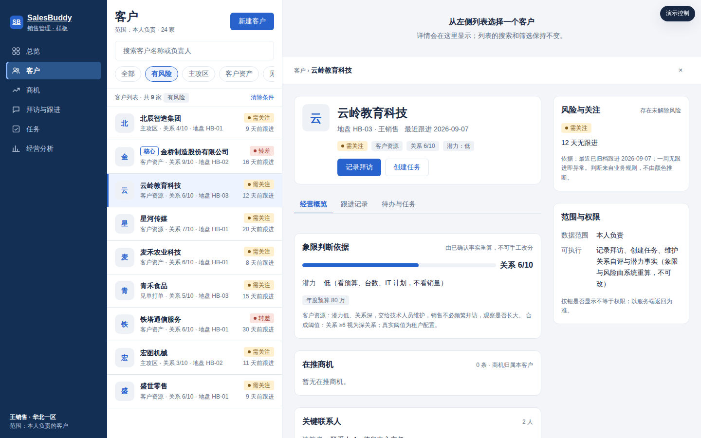
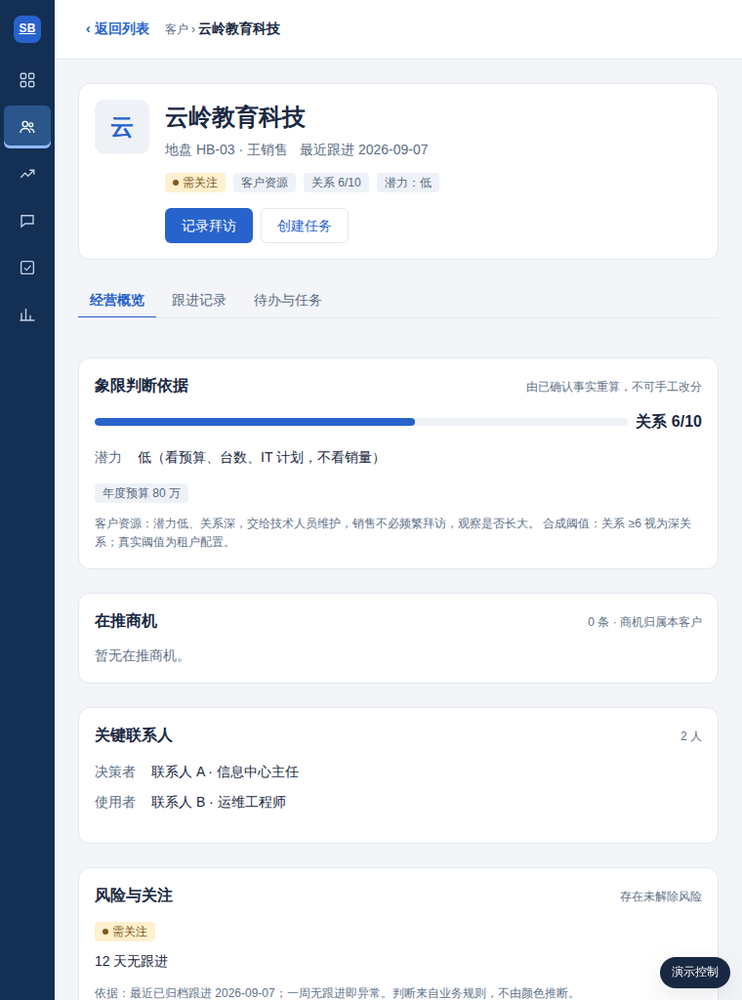
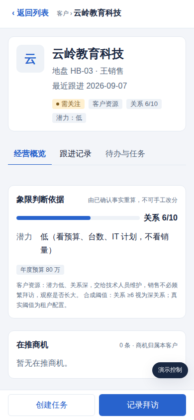

# 跨端样板：从客户列表进详情，再返回

电脑上导航、列表、详情三段布局，到手机上怎么组织？这个样板用**同一份页面**按窗口宽度自动切换三种布局，一眼看出哪些变了、哪些没变。

## 1｜目录里有什么

| 文件 | 用途 |
|---|---|
| `index.html` | 样板本体。电脑浏览器直接打开，拖窄窗口就能看到三档切换 |
| `对照.html` | 三个窗口并排，宽 1200／800／390，各自可操作 |
| `截图/` | 8 个视口 × 7 种状态的自动截图，以及同步实验前后对比 |
| `验收记录.md`、`验收结果.json` | 自动验收结果，252 项 |
| `verify.mjs`、`write-report.mjs` | 验收脚本，运行方法见下 |
| `build-artifact.mjs`、`dist-artifact.html` | 把 index.html 与生成的变量 CSS 合成单文件，用途见下 |

运行验收：`node verify.mjs && node write-report.mjs`。首次运行前先装浏览器：`npm i -D playwright@1.56 && npx playwright install chromium`，约 300MB。

`dist-artifact.html` 供 claude.ai 私有链接或任何只接受一个文件的地方使用。改了 index.html 或 tokens.json 后要重新运行 `build-artifact.mjs` 并重新发布，否则链接内容落后于仓库。

页面右上角有一个演示控制按钮，手机上在底部。它能切换列表的加载中和失败、详情的无权限和失败，也能一键填入无匹配关键词。它只属于样板，产品里没有。

## 2｜三档各自怎么组织

| 档位 | 导航 | 列表与详情 | 返回 | 留白／正文 |
|---|---|---|---|---|
| 电脑 >900px | 左侧深蓝导航栏，220px，文字 | 列表 360px 与详情并排；未选中时详情区显示「从左侧列表选择一个客户」 | × 或 Esc 关闭详情；列表始终在 | 24px／14px |
| 收紧 601～900px | 折叠成 56px 图标栏 | 二选一：打开详情时详情覆盖列表区，顶部「‹ 返回列表」 | 返回按钮或浏览器返回 | 24px／14px |
| 手机 ≤600px | 底部导航：总览、客户、商机、任务，加一个「更多」收纳拜访与跟进、经营分析 | 列表页点一行，详情整页进入；主动作「记录拜访」「创建任务」固定在底部并避开安全区 | 「‹ 返回列表」、浏览器或系统返回都回到原位 | 16px／16px |

手机档底部导航怎么分配是建议，待产品决定，见 `../01-三端规则对照表.md` 第 4 节第 2 条。

用示意图看三档，数字是宽度，单位 px：

```
电脑 >900        [导航 220][客户列表 360][客户详情 其余宽度]        三栏并排
收紧 601～900    [栏 56][客户列表 ────────────]                    点一行
                 [栏 56][客户详情（覆盖列表）‹返回列表 ]           ← 二选一
手机 ≤600        [客户列表 整宽]  → 点一行 →  [客户详情 整页 ‹返回]
                 [底部导航]                    [底部操作条：创建任务｜记录拜访]
```







**不变的部分**有这些：客户对象与字段，象限与关系等级，红黄绿灰及其依据，筛选归属与结果数，缺失值的写法，范围与权限提示，页签结构。缺失值写未登记、未填写或待评估。页签固定为经营概览、跟进记录、待办与任务。

**返回后保留什么**：搜索词、筛选片、滚动位置、选中行高亮，键盘焦点回到原行，地址里的客户标识清掉。刷新页面后，筛选与详情地址也还在。样板用 sessionStorage 和 URL hash 记住状态，例如 `#c=C1006`。真实产品应换成路由参数。这两个词的解释见文末名词。

这和三家官方做法一致。Apple 的分栏视图在窄屏折叠成导航堆栈。Android 与 Material 的列表与详情在 Compact 档一次只显示一层，返回时重新显示列表并保留选中。Windows 在 ≤640 堆叠，641 起并排。对照见 `../01-三端规则对照表.md` 第 2 节。

## 3｜样板遵守的业务口径

- 客户与商机分开。商机列在客户详情里，每条注明阶段与固定档位概率。概率固定为 10、30、50、70、90，分别对应识别、验证、方案、谈判、签约。ACV 没登记就写未登记。
- 关系等级 1～10，潜力分高低，两者都要带依据。潜力的依据看预算、台数、IT 计划。象限由这两项推出，不可手工改分。样板用的是合成阈值，关系 ≥6 视为深关系，潜力只分高低两值。真实阈值与量纲是租户配置，待产研拍板。
- 关系或潜力缺少依据的客户显示象限待评估，不落入任何一格。样板里的泰和银行就是这种情况。
- 每条已归档跟进记录都带下一步，下一步含日期和行动。归档时生成待办。待办与他人下发的任务是两种对象，页签里各标来源。
- 需关注标签来自跟进底线。一周无跟进即异常。核心客户在此之上再加一条，两周无高层或技术动作即异常。每个标签旁有依据。筛选片有风险的意思是存在未解除风险，合成数据用红和黄两色近似。
- 任务页签的说明文字是「已接受仍未完成；下一步计划未创建任务前不计入」。
- 负责人显示地盘编号加人名，例如 HB-01。
- 无权限是演示状态，不是服务端返回。按钮显不显示不等于有没有权限。
- 数据是合成的，24 家虚构客户，含一个超长客户名与一个从未跟进的客户。

## 4｜怎么验收，结果如何

自动验收在 8 个视口跑。电脑与收紧档是 1440、1366、1024、900、760，各 30 项。手机档是 600、390、320，各 34 项。共 252 项，全部通过。检查的内容有：档位判定，整页无横向溢出，搜索筛选，点开详情，返回后条件、滚动、选中、焦点是否保留，浏览器返回，刷新保留，无匹配、加载中、失败重试不丢条件、无权限四种状态，手机字号与触控目标，底部操作条位置，键盘 ↑↓ Enter Esc，无脚本错误。

**证据等级**是本地合成数据加 Chromium 模拟视口。它不能证明真机、真实接口、权限、小程序或 App。真机与小程序验收项见 `../1.0.0-使用包快照/模板/03-页面验收单.md`。

### 4.1 手工验收步骤，不用装工具

1. 用电脑浏览器打开 `index.html`，窗口拉宽到超过 900px：应看到左侧深蓝导航、中间列表、右侧「从左侧列表选择一个客户」。
2. 在搜索框输入「科」，点筛选片「有风险」：结果行应显示「共 2 家」。
3. 清空搜索、点「全部」，点第六行「云岭教育科技」：右侧显示详情，地址栏出现 `#c=C1006`，该行高亮。
4. 把窗口拖窄到 600px 以下：出现底部导航，详情变成整页并有「‹ 返回列表」和底部操作条。
5. 点「‹ 返回列表」：搜索、筛选、高亮行都还在，列表没有跳回顶部。
6. 点右下角「演示控制」，选「加载失败」，再点「重试」：搜索与筛选条件不丢。
7. 选「无权限（403）」后点任意客户：只显示「暂无查看权限」，不显示客户名。

按 1.0.0 模板填好的验收单在 `页面验收单-样板-本地.md`，证据等级同样是本地合成。

验收过程中修掉了三个样板问题，以后写规则时也要留意：
1. 收紧档和手机档整页横向溢出。被 `translateX(100%)` 移出的详情栏仍算进文档宽度，容器要加 `overflow:hidden`。
2. 手机返回后滚动位置漂移。详情打开时底部导航隐藏，列表容器变高，浏览器夹紧 scrollTop 并触发 scroll 事件，把滚动记录弄脏了。改法是详情打开期间不记录滚动。
3. 1024 宽时详情主栏被 280px 辅栏挤到 92px。分栏改为按详情栏实际宽度决定，≥760px 才分栏，不再看窗口宽度。这用的是容器查询，解释见文末名词。

## 5｜同步实验：改一处，各端是否跟着变

把 `tokens.json` 里 `ui.card-padding` 从 `{space.4}` 改为 `{space.6}`，也就是从 16 改为 24，重新生成：

| 产物 | 结果 |
|---|---|
| `dist/design-tokens.css` | `--ui-card-padding: 24px` |
| `dist/design-tokens.wxss` | `--ui-card-padding: 24px` |
| `dist/design-tokens.json` | 四端均 `24px` |
| 样板页详情卡片 | 计算样式 `padding-left: 24px`，截图 `截图/同步实验-卡片内边距24.png` |

随后改回并重新生成，兼容校验通过，卡片回到 16px，截图在 `截图/同步实验-卡片内边距16.png`。app.json 颜色片段不含卡片内边距，所以不变。这只证明生成这一步是同步的。小程序页面还没引用变量，所以不会变。

## 6｜与真实产品的差距

样板不等于做完了。各端现状如下。

| 端 | 现状 | 差距 |
|---|---|---|
| 电脑 Web（sales-web） | 工程不在本仓库，只有 1.0.0 示例册快照 | 样板尚未合入工程；需按 T-02／T-03 改真实客户页 |
| 手机网页 | 同上，响应式 Web | 同上 |
| 微信小程序 | 本仓库有源码：详情是页内浮层，系统返回关不掉；0 处变量；88% 字号 <14px | 见 `../02-设计变量与同步链路/小程序样式现状核查.md` 第 6 节的最小接入动作 |
| 原生 App | 是否在范围未知 | 待确认 |

## 7｜下一步采用清单

都在 `../采用登记表.md` 里，按产品、终端、版本登记，另列待决定事项。

## 8｜名词

- sessionStorage：浏览器的临时存储，关掉标签页即清空。
- URL hash：地址栏 # 后面的参数。
- 容器查询：CSS 按某个盒子自身宽度切换布局，而不是按整个窗口宽度。
