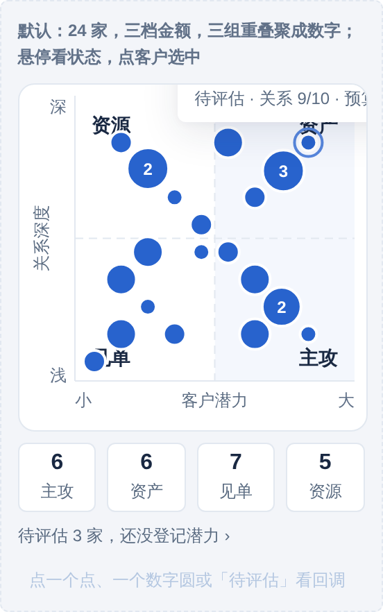
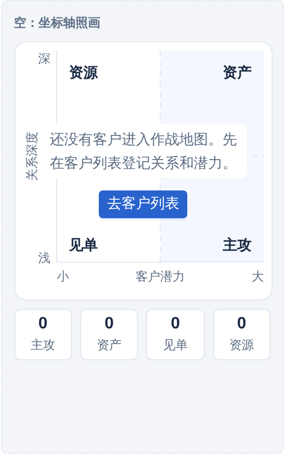
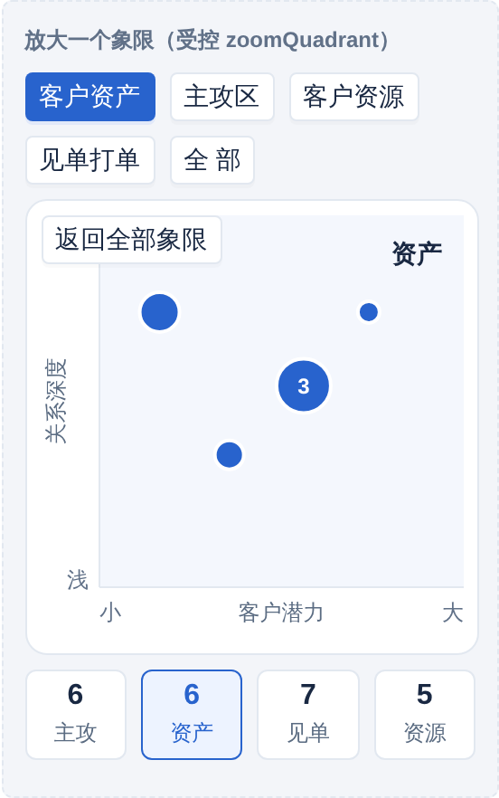
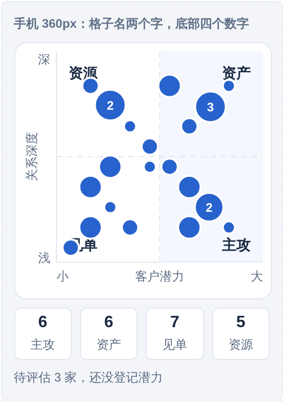
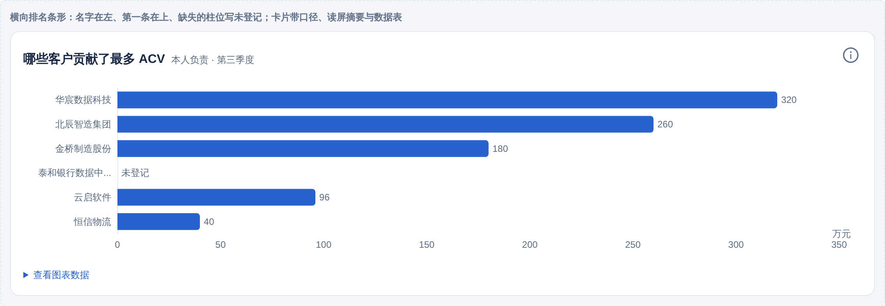
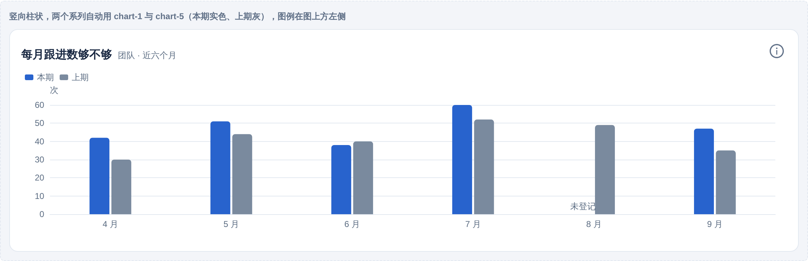
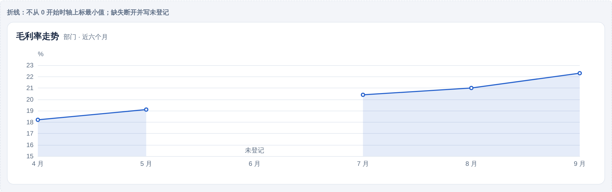
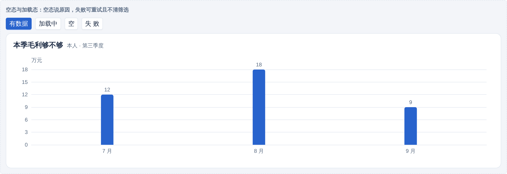

# 图表规范：作战地图与看板怎么画

作战地图是关系 × 潜力四象限，每个客户一个点。看板是指标卡加柱线图。董事长看的就是这两样，现在没有一条规则。小程序 v1.0.6 里只有一张画像雷达图，别的图还没做，所以这份规范先于代码。

## 1｜六条总则

1. **图先回答一个问题。** 每张图标题写它回答什么：「哪些客户该多跑」「本季毛利够不够」。回答不了具体问题的图不放。
2. **颜色有含义才用。** 象限用象限色，状态用红黄绿灰，其余系列用固定顺序色。不为好看加颜色。
3. **没数据就说没数据。** 缺失显示「未登记」，不画成 0；一个点也画坐标轴；空图显示原因和下一步。
4. **图旁必有数。** 每张图能切到数据表，董事长要看数时不用猜。
5. **字不小于 12。** 坐标轴、图例、标签都用 `--ui-text-small` 起，手机上 24rpx 起。
6. **点得进去。** 图上的点和柱都能点到对应的客户、商机或明细，悬停显示依据。

## 2｜作战地图（四象限）

### 2.1 坐标

- 横轴客户潜力，从左到右小到大；纵轴关系深度，从下到上浅到深。和说明书一致（03 章约-11），和董事长 PPT 的轴向相反但象限含义不变。潜力大的两格在右边，眼睛先看右边。
- 关系等级 1～10 直接当纵坐标，5.5 是分界线。潜力按预算、台数、IT 计划算成 1～10，分界线也是 5.5。算法是业务口径，不在本规范。
- 轴上不标刻度数字，只在两端标「浅」「深」「小」「大」。分界线是虚线。

### 2.2 四个格子

| 格子 | 位置 | 底色 | 名字标在 | 含义一句话 |
|---|---|---|---|---|
| 客户资产 | 右上 | `--ui-quadrant-asset`，主色 5% | 格子右上角 | 关系好潜力大，要求高毛利 |
| 主攻区 | 右下 | `--ui-quadrant-attack`，主色 5% | 右下角 | 潜力大关系浅，精力主要放这里 |
| 客户资源 | 左上 | `--ui-quadrant-resource`，白 | 左上角 | 关系好潜力小，让技术去 |
| 见单打单 | 左下 | `--ui-quadrant-spot`，白 | 左下角 | 有单就打，不花精力 |

底色只有一种淡主色，只涂右边两格（潜力大），左边两格白；不用红黄绿。四个格子的名字永远显示，不靠图例。整张图只有底色、点、分界线三层，颜色出现就有意义（14 章第十条）。四个底色变量已加进 tokens 1.2.0-draft.1（建议）。

### 2.3 点

- 一个客户一个圆点。默认直径 `--ui-icon-sm`（16px），手机 32rpx。
- 点的大小按金额档分三档：小、中、大，直径 12、16、22（潜力已经在横轴上，不再用大小重复表达；金额档由页面按 ACV 或年度合同额分档，口径在页面）。不按销量。
- 点一律主色实心，不按状态上色（2026-09-24 决定，取代原来的「需关注黄、转差红、待评估空心」）。地图只回答「客户在哪一格、金额多大」；客户状态在悬停提示和点开后的客户卡里用状态标签写，不在点上。原因：一屏几十个点里红黄一多就互相抢，象限底色、点色、点径三层叠在一起读不出重点；状态本来就有状态标签表达，和 14 章「颜色有意义才出现」一致。
- 图例只画三档点径（小、中、大，和地图上同尺寸）加一句「点越大，在推金额越高」，不画状态色。
- 点旁默认不标名字。选中或悬停时标名字加一行摘要：「华宸数据科技 · 关系 8/10 · 预算 320 万」。
- 点重叠时聚成一个大圆写数字，点开展开列表。手机上超过 30 个点就默认聚合。

### 2.4 缺失

- 关系或潜力任一没填的客户，不画进格子。图下方一行「待评估 N 家，还没登记潜力」，点开是列表。
- 整张图没有客户：显示「还没有客户进入作战地图。先在客户列表登记关系和潜力。」加「去客户列表」按钮，坐标轴与四个格子照画。

### 2.5 交互

- 点一个点进客户详情，返回时地图保留缩放和选中。
- 顶部筛选：范围（本人、团队、部门）、行业、周期。筛选按 C-04 做。
- 可以按周期看变化：选「和上季度比」时，移动过的点画一条细箭头从旧位置指到新位置，箭头用 `--ui-secondary`。这是董事长要的「一格一格往右上移」。
- 象限不可拖动。销售不能把点拖到别的格子，这是产品原则。

### 2.6 手机

- 图保持正方形，宽度撑满，四个格子的名字缩成两个字：资产、主攻、资源、见单，点格子名显示全称。
- 底部一行四个数字：各格子客户数，点数字筛选该格子。

## 3｜看板

### 3.1 指标卡

- 用 SbMetricTile：大数字 32、说明 14、变化 12。缺失显示「未登记」。
- 一行最多四张，手机两张。数字带单位，单位小一号放数字后。
- 变化写「比上季 +12%」或「比上季 −3 家」，升绿降红只用于业务上有好坏的指标；客户数这种无好坏的用灰。组件是 SbKpiCard。

### 3.2 柱状图与折线图

- 一张图最多五个系列，颜色按顺序色 `--ui-chart-1` 到 `--ui-chart-5`。第一个永远是主色。
- 系列名写在图例，图例在图上方左侧，不放右侧。
- 柱状图从 0 开始，不截断。折线图可以不从 0，但要在轴上标最小值。
- 时间轴按周期写：「7 月」「8 月」「9 月」，不写 2026-07。
- 数字标签只在柱少于八根时显示；多了只在悬停显示。
- 条形图（横柱）用于排名，名字在左，最长的在上。排名最多显示 10 条，其余「查看全部」。组件是 SbBarChart（横向）。

### 3.3 饼图与雷达图

- 饼图只在份额确实是重点时用，最多五块，小于 5% 的合并成「其他」。能用柱状图就用柱状图。
- 雷达图只用于画像的多维度对比，最多六个维度，每个维度的满分一样。现有的画像雷达图保留，按本规范换色和字号。

### 3.4 颜色

顺序色五个，都是建议，从主色出发派生，和红黄绿灰状态色错开：

| 变量 | 值 | 用途 |
|---|---|---|
| `--ui-chart-1` | #2863CD 主色 | 第一系列、本期 |
| `--ui-chart-2` | #0E8A8A 青 | 第二系列、上期 |
| `--ui-chart-3` | #6B4FBB 紫 | 第三系列 |
| `--ui-chart-4` | #C7741B 橙 | 第四系列 |
| `--ui-chart-5` | #7A8A9E 灰蓝 | 第五系列、其他 |

只有两个系列时用 1 和 5，本期实色、上期灰。图表里的红黄绿只表示业务状态，不当系列色。

### 3.5 空与错

- 没数据：图区显示「这个周期还没有数据」和原因，坐标轴照画。
- 加载失败：「加载失败，网络不通」加重试，筛选保留。
- 部分缺失：柱子照画，缺的那根位置写「未登记」，不画成 0。

## 4｜通用规则

| 项 | 规则 |
|---|---|
| 标题 | 每张图有标题，写它回答的问题或指标名；范围和周期紧挨标题，按 T-05 |
| 字号 | 标题 16，轴和图例 12，悬停框正文 14 |
| 边距 | 图区四周 `--ui-space-4`，图例和图区之间 `--ui-space-2` |
| 网格线 | 只画横线，用 `--ui-line`，不画竖线 |
| 悬停框 | 白底、`--ui-shadow-popup`、圆角 6；第一行对象名，后面是指标和依据 |
| 动画 | 首次出现 300 毫秒内画完，切换数据不重放动画 |
| 导出 | 周报导出时图表转成图片，页脚带范围、周期、生成时间和「由 AI 起草」标识 |
| 无障碍 | 每张图有一句文字摘要给读屏用：「客户资产 12 家，主攻区 9 家…」 |

## 5｜怎么实现

- Web 用 ECharts 6（按需引入，SVG 渲染），小程序用 echarts-for-weixin 的 ec-canvas。两端同一份主题：`@shandiant/tokens/bridge-echarts`（tokens 包 dist/bridge-echarts.theme.json，由 tokens.json 生成），颜色、字号、网格线、坐标轴、悬停框全部来自变量，页面不写死。
- 组件（ui-react 0.6.0，小程序 ui-miniprogram 0.6.0）：
  - SbBattleMap／sb-battle-map：作战地图。输入只有一份数据：点的列表（id、name、potential、relationship、tone、amountBand）加两条阈值；四个格子的名字和说明写死在组件里；点象限放大、点客户进详情、空态、待评估计数、重叠聚合都在组件里。Web 用 SVG 画，小程序用 view 绝对定位画，都不用 canvas。
  - SbChartCard／sb-chart-card：图表卡片壳，标题、范围周期、口径、图例、四态、读屏摘要、数据表。
  - SbKpiCard／sb-kpi-card：指标卡，数字、单位、说明、变化。
  - SbBarChart、SbLineChart：横向条形或竖向柱状、折线。小程序图区用 ec-canvas，暂无壳。
- 变量新增九个（建议，tokens 1.2.0-draft.1）：四个象限底色 `--ui-quadrant-asset／attack／resource／spot`，五个顺序色 `--ui-chart-1`（主色）到 `--ui-chart-5`。
- 页面只传数据：客户页把客户列表交给 SbBattleMap；经营分析页把阶段 ACV、跟进节奏、季度时间线交给 SbBarChart／SbLineChart，外面套 SbChartCard。

## 6｜怎么检查

- 象限四个名字是否永远可见；点是否一律主色、只用大小区分金额档；点开后客户卡里是否有状态标签。
- 没登记潜力的客户是否没画进格子、是否有「待评估 N 家」。
- 空图是否有文字和下一步；缺失是否写「未登记」而不是 0。
- 字号是否不小于 12；图旁有没有数据表入口。
- 点一个点能否进详情，返回是否保留筛选和选中。

## 7｜还没定的

- 潜力 1～10 的算法：预算、台数、IT 计划怎么加权。业务口径，要产品定。
- 「和上季度比」的箭头是默认显示还是点开才显示；组件里还没做箭头。
- 金额档（点的大小）按什么金额、怎么分三档：页面口径，待产品定。
- 作战地图要不要给董事长一个只读的全集团视图，范围词叫什么。
- 小程序 ec-canvas 在低端机上的性能没测。
